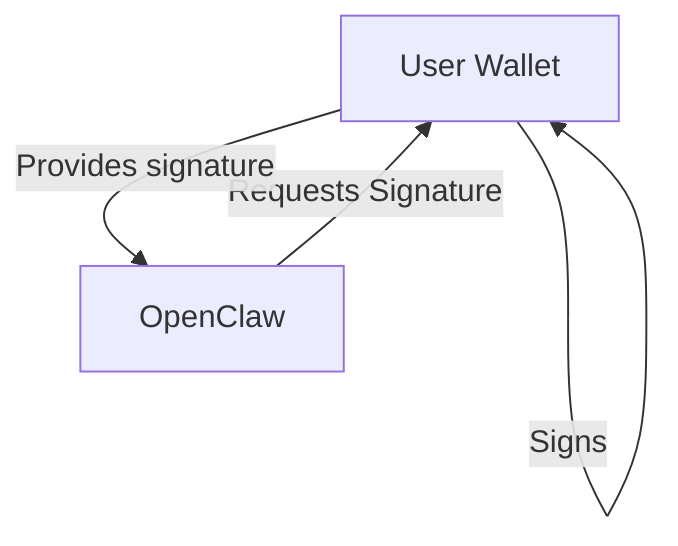

# Rocca (no algo)

## Features

- Passkeys
- LiquidAuth
- xHDWallets
- Mnemonic Backup / Recovery
- DID (did:key) 

# Worldchess v1 (algo)

## Features
- Passkeys
- LiquidAuth
- xHDWallets
- Mnemonic Backup / Recovery
- DID (did:key) 

- Accounts
- Assets
- Sponsored Fees
-- intermezzo? 

# AI chat App (no algo)

- Passkeys
- LiquidAuth
- xHDWallets
- Mnemonic Backup / Recovery
- DID (did:key) 
- Messaging Protocol / Signing Flow
- AI Skills
- Openclaw Plugin

// diagram where the user wallet talks with the AI bot and the bot asks for signatures and the user approves them in the wallet, then the bot can execute actions on behalf of the user. 

